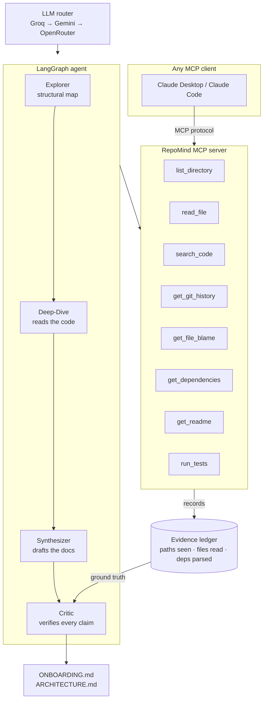

# RepoMind

**Point it at a repository. Get an onboarding guide that doesn't make things up.**

An MCP server plus a LangGraph agent that reads a codebase and writes the
documentation a new hire actually needs — what this project is, how to run it,
where to start reading, and how it's tested. Every file path in the output is
verified against real tool calls before the document is written. It runs
entirely on free-tier LLM APIs.

[](https://github.com/akashdeb2105-art/Repomind/actions)
[](LICENSE)

---

## The problem

Every unfamiliar repository costs a developer hours before they write a line of
code: where is the entry point, what talks to what, how do I run the tests.
"AI explains your codebase" tools exist, and they hallucinate — confidently
describing `src/config/settings.py` in a project that has no such file. A
document that is fluent and wrong is worse than no document, because a reader
cannot tell which half to trust.

RepoMind's answer is not a better prompt. It is a **verification pass**: the
generated documents are checked, claim by claim, against the results of tool
calls that actually happened. A file path either appeared in a real
`list_directory` result or it did not. Fabricated paths are stripped before the
document is written, and the report says how many there were.

Across 12 real open-source repositories: **213 of 219 file references verified
(97%), 6 fabrications caught and removed, $0.00 spent.**

## Architecture



The agent never sees the repository directly. It sees **tool results**, and
every one of them is recorded in the evidence ledger. That is what makes "was
this claim grounded?" a lookup rather than an opinion.

## Quickstart

```bash
pip install -e ".[all]"
cp .env.example .env      # add a free API key — see Providers below
```

```bash
repomind analyze https://github.com/psf/requests   # generate the documents
repomind ask "how does retry logic work?"          # answer, with cited sources
repomind tools .                                   # run the tools — no LLM, no key
repomind check                                     # verify the free providers
```

### Use it from Claude Desktop or Claude Code

Add RepoMind to your MCP config (`claude_desktop_config.json`):

```json
{
  "mcpServers": {
    "repomind": {
      "command": "repomind-mcp",
      "args": ["/absolute/path/to/the/repository"]
    }
  }
}
```

Restart the client. Claude gets eight read-only tools over that repository.
For clients that take a URL instead of a command:

```bash
repomind serve . --transport http --port 8765   # http://127.0.0.1:8765/mcp
```

## Results

Twelve real repositories, varied in size, language and layout. Full table in
[BENCHMARKS.md](BENCHMARKS.md); reproduce with `python eval/run_benchmark.py`.

| Repo | Size | Lang | Files | Read | Time | Tokens | Verified | Fabricated |
|---|---|---|---|---|---|---|---|---|
| itsdangerous | small | python | 49 | 1 | 17s | 9,696 | 11/11 | 0 |
| chalk | small | javascript | 28 | 4 | 17s | 12,946 | 11/11 | 0 |
| slugify | small | javascript | 12 | 3 | 15s | 9,472 | 7/7 | 0 |
| click | medium | python | 165 | 8 | 31s | 30,884 | 25/25 | 0 |
| requests | medium | python | 123 | 8 | 31s | 31,179 | 21/21 | 0 |
| typer | medium | python | 392 | 8 | 44s | 36,161 | 19/20 | 1 |
| httpx | medium | python | 122 | 8 | 34s | 30,398 | 19/19 | 0 |
| attrs | medium | python | 139 | 8 | 29s | 27,054 | 23/23 | 0 |
| axios | medium | javascript | 418 | 8 | 30s | 32,652 | 17/17 | 0 |
| express | medium | javascript | 207 | 7 | 39s | 26,892 | 18/19 | 1 |
| cobra | medium | go | 65 | 8 | 31s | 25,825 | 20/22 | 2 |
| flask | large | python | 220 | 8 | 33s | 30,539 | 22/24 | 2 |

**Totals:** 12/12 analysed · 213/219 references verified (97%) · 6 fabrications
removed · 303,698 tokens · 29s median · **$0.00**

Groq's daily token budget ran out partway through, so this run was served almost
entirely by the Gemini fallback. That is not a caveat on the numbers — it is the
fallback doing its job, on the record.

## Providers

Requests go to Groq first and fall through to Gemini, then OpenRouter, on rate
limits or errors. All three are free tiers requiring no credit card.

| # | Provider | Default model | Upstream | Get a key |
|---|---|---|---|---|
| 1 | Groq | `openai/gpt-oss-120b` | Groq | [console.groq.com](https://console.groq.com) |
| 2 | Google Gemini | `gemini-3.5-flash-lite` | Google | [aistudio.google.com](https://aistudio.google.com) |
| 3 | NVIDIA | `nvidia/nemotron-3.5-lightning-30b-a3b` | NVIDIA | [build.nvidia.com](https://build.nvidia.com) |
| 4 | OpenRouter | `minimax/minimax-m3:free` | GMICloud | [openrouter.ai](https://openrouter.ai) |
| 5 | NaraRouter | `qwen3.8-27b` | Alibaba Cloud | [router.bynara.id](https://router.bynara.id) |

**Five providers, five distinct upstreams.** That column is the point: a chain
whose links share a backend fails together, however many links it has. Two
obvious model choices were rejected for exactly that reason — OpenRouter's
`gemma-4:free` is served by Google AI Studio (same as entry 2) and its
`nemotron:free` by NVIDIA (same as entry 3), so the last link uses MiniMax on
GMICloud instead.

Order is by measured latency (`repomind check`: 1.07s / 1.23s / ~1.3s / 6.06s /
7.95s), not by preference — NaraRouter went in at position 2 on reasoning and
ended up last once timed.

Model choice is constrained by more than capability. NVIDIA's
`deepseek-v4-flash` is the strongest coding model available here and is *not*
used: NVIDIA serves it with thinking on at high reasoning effort, and it timed
out on every 60-second call. A fallback link that cannot answer inside a timeout
provides no fallback. NaraRouter additionally requires binding a Telegram
account before its free tier will answer, which is worth knowing before you
depend on it.

Any provider whose key is absent is skipped rather than treated as an error, so
a working install needs only one of them.

Model identifiers are configuration, not code — free-tier catalogues churn, and
every one of these defaults will eventually go stale.
`python scripts/list_models.py` asks each provider what it currently offers;
override in `.env` rather than editing source.

Two free tiers log traffic to improve their own products: Google's, and NVIDIA's
free endpoint reached through OpenRouter. RepoMind only ever sends public
open-source code, so this costs nothing here — but anyone pointing it at a
private repository should read those terms first, and can drop either provider
from `REPOMIND_PROVIDER_ORDER` without touching code.

## Design decisions & trade-offs

**Why MCP rather than a chat wrapper.** The tools are the product. Exposing them
over MCP means someone else's Claude can read a repository with no RepoMind code
in their loop — the agent in this repo becomes one consumer of the tools rather
than the only way to use them. It also forces a clean boundary: the repository
root is fixed when the server starts and no tool accepts a root argument, so text
inside an analysed repository cannot redirect reads elsewhere on disk.

**Why LangGraph, and why it barely shows.** The four nodes are plain functions of
state; LangGraph contributes state merging and execution order. That is
deliberate — the pipeline runs without it (`run_pipeline(use_langgraph=False)`)
and every node is unit-tested with a scripted model and no network. A framework
that owns your control flow makes the interesting logic hard to test.

**Why verification is deterministic, not another model.** Asking a model "did you
make up any files?" asks the thing that hallucinated to notice it hallucinated.
Path checks are a regex and a set lookup against the evidence ledger; they cannot
be argued with. A second LLM pass runs *after*, catching what a regex cannot —
invented behaviour, imagined install commands, versions — and it can only **add**
findings, never overturn the deterministic verdict. The two are reported
separately because they are different kinds of evidence.

**Why a multi-provider fallback instead of one provider.** Free tiers rate-limit.
During the benchmark Groq hit its per-minute limit constantly and its daily limit
entirely; the run completed on Gemini. A single-provider build would have stopped.
The router reads the wait a provider asks for and honours it when it is short
(≤15s) or fails over immediately when it is long — guessing when you have been
told is how a free tier turns every rate limit into an outage.

**Why "files read" is in the benchmark table.** It predicts fabrication. The runs
that read fewest files produced the most invented paths, because a Synthesizer
with only a directory listing fills the gap with what a project like this usually
contains. Verification keeps that out of the output; it cannot make the document
richer. Truth and usefulness are separate problems and this project solves the
first more completely than the second.

**What was cut.** No embeddings or vector store — targeted `search_code` plus
`read_file` was enough at this scale, and a retrieval index is a second system to
keep correct. No fine-tuning. No multi-tenant hosting. No attempt to treat every
language equally: Python and JavaScript work well, Go degrades gracefully, and
anything else gets structure without depth.

**Known limitations.** Deep-Dive reads at most 8 files, so very large
repositories get a shallow read. The LLM-as-judge scores in `BENCHMARKS.md` are
weak evidence and labelled as such. `run_tests` is disabled unless
`REPOMIND_ALLOW_TEST_EXECUTION=1`, because analysing a stranger's repository
should not silently execute their `conftest.py`.

## Development

```bash
pip install -e ".[dev]"
pytest                                # 150 tests, no API keys needed
python scripts/check_providers.py     # live provider + fallback drill
python scripts/demo_tools.py          # run all eight tools against this repo
python eval/run_benchmark.py          # rebuild BENCHMARKS.md
```

The test suite mocks HTTP, so CI never spends free-tier quota and never flakes on
a rate limit. Live checks are separate scripts, run by a human.

## License

MIT — see [LICENSE](LICENSE).
