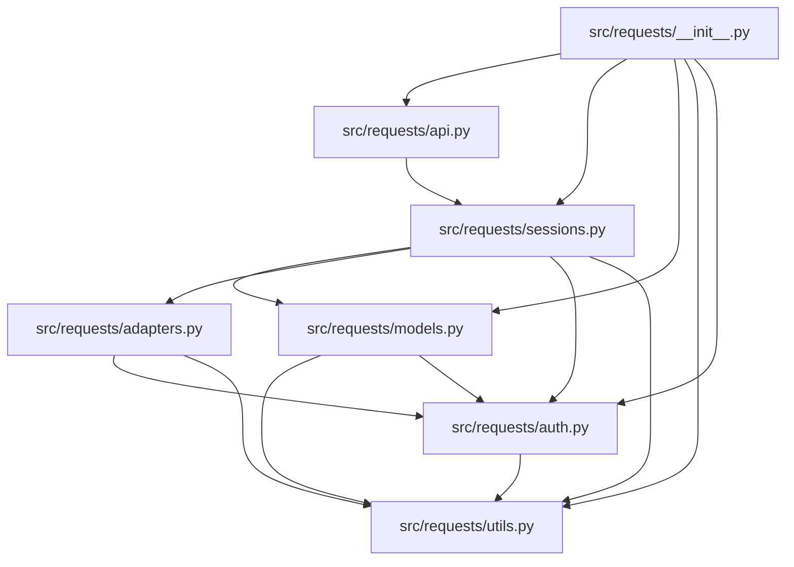

# Architecture Overview

## Overview
Requests is structured around a clean separation between user-facing APIs, session state management, low-level data modeling, transport/connection handling, authentication, and utilities. Users invoke high-level functions or `Session` objects, which construct and prepare request models. These prepared requests are then dispatched through transport adapters that interface with underlying libraries like `urllib3`, returning structured `Response` objects.

## Component Relationships

## Component Responsibilities

- **`src/requests/__init__.py`**: Package entry point that validates third-party compatibility, sets up logging/warnings, and exposes the public API.
- **`src/requests/api.py`**: Exposes top-level convenience functions (`get`, `post`, `put`, etc.) that wrap session handling.
- **`src/requests/sessions.py`**: Implements the `Session` class to persist cookies, headers, authentication, and configurations across multiple requests.
- **`src/requests/models.py`**: Defines core data structures (`Request`, `PreparedRequest`, `Response`) and encoding/hook mixins.
- **`src/requests/adapters.py`**: Implements transport adapters (`BaseAdapter`, `HTTPAdapter`) to manage connection pooling, retries, proxies, and SSL verification via `urllib3`.
- **`src/requests/auth.py`**: Provides handlers for various authentication schemes (Basic, Proxy, Digest).
- **`src/requests/utils.py`**: Houses utility routines for header parsing, encoding detection, URI quoting, and environment proxy lookup.
